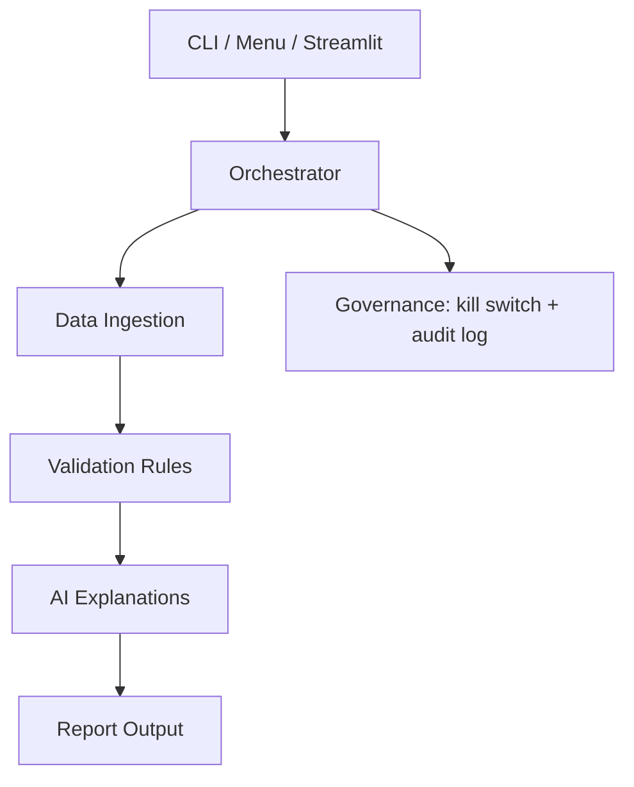

# Billing Validation Agent System

An AI-assisted billing validation prototype that detects incorrect rates, excess billed
hours, and contract-limit breaches across work logs, agreed rates, and invoice records.
It produces audit-friendly output with plain-English explanations so teams can review
exceptions before invoices reach the client.

AI-generated remediation recommendations are advisory. A billing supervisor should review
and approve them before credits, invoice adjustments, or client-facing corrections are issued.

---

## Quick Start

### 1. Clone the repo

```bash
git clone https://github.com/AI-Transformation-Technical-TestPack/TP-EvaluationProject-AITransformation.git
cd TP-EvaluationProject-AITransformation
```

### 2. Create a virtual environment

```bash
python3 -m venv .venv
```

### 3. Activate the environment

```bash
source .venv/bin/activate
```

On Windows: `.venv\Scripts\activate`.

### 4. Install dependencies

```bash
pip install -r requirements.txt
```

### 5. Create the local config

```bash
cp .env.example .env
```

### 6. Configure the API key

Open `.env` and set `ANTHROPIC_API_KEY=sk-ant-...`. Obtain a key at <https://console.anthropic.com/>.

```bash
code .env
```

For OpenAI, OpenAI-compatible providers, or the no-key deterministic path, see [`docs/usage.md`](docs/usage.md).

### 7. Run the pipeline

Three interfaces. All write the same artifacts to `data/output/`.

**Web UI** (Streamlit)

```bash
streamlit run app.py
```

**Command line**

```bash
python main.py --verbose
```

**Interactive menu**

```bash
python main.py --interactive
```

#### Output artifacts

- `data/output/validation_report.csv` — flagged report. The `AI_Explanation` column contains the schema-versioned JSON contract for each ERROR row.
- `data/output/audit.log` — per-agent ISO-timestamped trail (START / DONE / INFO / ERROR / HALT / COMPLETE).

Sample data: 5 records → 1 OK, 4 ERROR.

For alternative providers, deterministic fallback, governance toggles, per-flag tests, and the reviewer self-guided tour, see [`docs/usage.md`](docs/usage.md).

---

## What It Does

The system reads billing source files, validates their structure, compares expected charges
against proposed invoice values, and marks rows that require review. For each error row, it
generates a structured JSON explanation using the configured AI provider.
The final report is written to `data/output/validation_report.csv`, while the orchestrator records
pipeline activity in `data/output/audit.log`.

The sample quick start run should process 5 records: 1 `OK` row and 4 `ERROR` rows.

| Capability | How It Works |
|---|---|
| Data intake | The ingestion step reads the sample files from `data/input/` and verifies that required columns are present before validation begins. |
| Billing checks | The validation step calculates expected amount, billed amount, **capped expected amount** (strict-cap interpretation), difference, and over-cap exposure, then marks rows with `RATE_MISMATCH`, `OVERBILLING`, `UNDERBILLING`, `CONTRACT_VIOLATION`, `BILLING_OVER_MAX`, `GHOST_BILLING`, `MISSING_BILLING`, `MISSING_CONTRACT`, or `DUPLICATE_RECORD`. Formulas are documented in `docs/validation-logic.md`. |
| Explanation output | The explanation step generates a structured JSON explanation for each error row using the configured AI provider, and stores it in the `AI_Explanation` field in the final report. A deterministic fallback is available. |
| Client rules | The validation policy comes from `config/client_rules.json`, so client-specific tolerances can change without editing validation code. |
| Review paths | A user can run the pipeline from the CLI, follow the local interactive menu, or use the Streamlit interface to upload files and inspect results in a browser. |

---

## System Overview



For detailed design rationale, validation formulas, governance controls, and ADRs, see `docs/`.

---

## Repository Structure

```
EvaluationProject/
├── agents/              # Worker agents: ingestion, validation, AI explanation, report
├── config/              # Client rules, kill switch, RBAC role model
├── data/
│   ├── input/           # Sample timesheet, contracts, and billing CSV files
│   └── output/          # Generated report and audit log (gitignored)
├── docs/                # Usage, architecture, validation, governance, requirements, ADRs, candidate-reasoning narrative
├── orchestrator/        # Central workflow coordinator
├── prompts/             # Version-controlled AI prompt template
├── tests/               # Pytest test suite (unit, CLI, end-to-end)
├── app.py               # Streamlit web UI
├── main.py              # CLI entry point
├── requirements.txt
└── .env.example         # Template for your local .env
```

---

## Documentation Guide

| Need | Start Here |
|---|---|
| Run alternative commands, governance toggles, or the reviewer self-guided tour | [`docs/usage.md`](docs/usage.md) |
| Understand the workflow and diagrams | [`docs/architecture.md`](docs/architecture.md) |
| Review billing rules and calculations | [`docs/validation-logic.md`](docs/validation-logic.md) |
| Review audit, safety, and Human-in-the-Loop controls | [`docs/governance.md`](docs/governance.md) |
| Review functional requirements | [`docs/requirements.md`](docs/requirements.md) |
| Review design decisions | [`docs/decisions/`](docs/decisions/) |

---

Sterling Díaz · sterlingdiazd@gmail.com · MIT License
