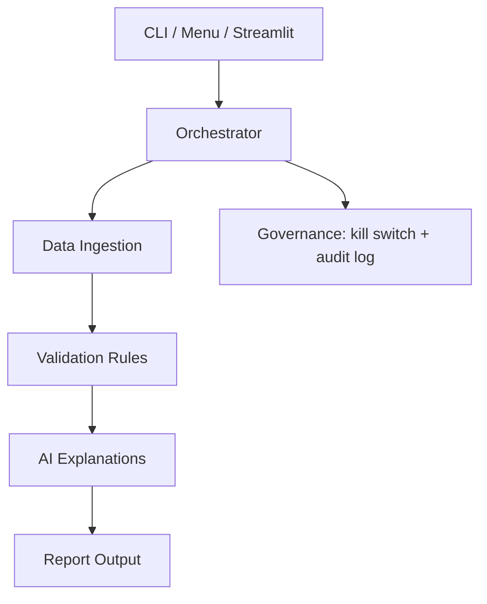

# Billing Validation Agent System

An AI-assisted billing validation prototype that detects incorrect rates, excess billed
hours, and contract-limit breaches across work logs, agreed rates, and invoice records.
It produces audit-friendly output with plain-English explanations so teams can review
exceptions before invoices reach the client.

AI-generated remediation recommendations are advisory. A billing supervisor should review
and approve them before credits, invoice adjustments, or client-facing corrections are issued.

---

## Quick Start

```bash
# 1. Clone and enter the repo using your favorite terminal
git clone https://github.com/AI-Transformation-Technical-TestPack/TP-EvaluationProject-AITransformation.git
cd TP-EvaluationProject-AITransformation

# 2. Create a local virtual environment and install dependencies
python3 -m venv .venv
source .venv/bin/activate
python -m pip install -r requirements.txt

# 3. Set your API key (optional)
cp .env.example .env
# edit AI_PROVIDER and the matching API key for Anthropic, OpenAI, or a compatible endpoint

# 4. Run validation
python main.py --mode orchestrated --input data/input/billing.csv --verbose
```

On Windows, use `python` instead of `python3` and activate the environment with
`.venv\Scripts\activate`.

Or launch the web UI:

```bash
streamlit run app.py
```

---

## What It Does

The system reads billing source files, validates their structure, compares expected charges
against proposed invoice values, and marks rows that require review. For each error row, it
generates a structured JSON explanation using the configured AI provider.
The final report is written to `output/validation_report.csv`, while the orchestrator records
pipeline activity in `output/audit.log`.

The sample quick start run should process 5 records: 1 `OK` row and 4 `ERROR` rows.
It should create `output/validation_report.csv` and `output/audit.log`.

| Capability | How It Works |
|---|---|
| Data intake | The ingestion step reads the sample files from `data/input/` and verifies that required columns are present before validation begins. |
| Billing checks | The validation step calculates expected amount, billed amount, **capped expected amount** (strict-cap interpretation), difference, and over-cap exposure, then marks rows with `RATE_MISMATCH`, `OVERBILLING`, `UNDERBILLING`, `CONTRACT_VIOLATION`, `BILLING_OVER_MAX`, `GHOST_BILLING`, `MISSING_BILLING`, `MISSING_CONTRACT`, or `DUPLICATE_RECORD`. Formulas are documented in `docs/validation-logic.md`. |
| Explanation output | The explanation step generates a structured JSON explanation for each error row using the configured AI provider, and stores it in the `AI_Explanation` field in the final report. A deterministic fallback is available. |
| Client rules | The validation policy comes from `config/client_rules.json`, so client-specific tolerances can change without editing validation code. |
| Review paths | A user can run the pipeline from the CLI, follow the local interactive menu, or use the Streamlit interface to upload files and inspect results in a browser. |

---

## System Overview



The README is focused on understanding and running the project. For more detailed
design rationale, validation logic, governance controls, and ADRs, refer to `docs/`.

---

## CLI Reference

```bash
# Full orchestrated run
python main.py --mode orchestrated --input data/input/billing.csv --verbose

# Choose an AI provider
python main.py --ai-provider openai --input data/input/billing.csv

# Run without AI provider calls
python main.py --no-ai --input data/input/billing.csv

# Select a different client rule set
python main.py --client client_b --input data/input/billing.csv

# Launch guided terminal menu
python main.py --interactive
```

### API-key confirmation flow

If you run the CLI without setting `ANTHROPIC_API_KEY` (or `OPENAI_API_KEY` when `--ai-provider openai` is selected) and **without** passing `--no-ai`, the CLI will refuse to silently downgrade. Instead, it warns that the run will use the deterministic / programmatic fallback and asks for explicit confirmation:

```
⚠  No API key found for provider: anthropic
   Expected env var: ANTHROPIC_API_KEY
   …
Continue in deterministic mode? [y/N]:
```

Three ways to bypass the prompt:

| Situation | Use |
|-----------|-----|
| You intentionally want the deterministic mode | `--no-ai` |
| You're in CI / non-interactive context | `--yes` (or simply pipe stdin — non-TTY is auto-accepted with a stderr notice) |
| You want AI mode | Set `ANTHROPIC_API_KEY` (or `OPENAI_API_KEY`) and re-run |

The intent is governance-first: the deterministic fallback is fully supported, but it must be a **conscious choice**, not an accidental degradation.

---

## Repository Structure

```
EvaluationProject/
├── agents/              # Worker agents: ingestion, validation, AI explanation, report
├── config/              # Client-specific validation rules
├── data/input/          # Sample timesheet, contracts, and billing CSV files
├── docs/                # Architecture, validation, governance, requirements, ADRs
├── governance/          # Kill switch and RBAC configuration
├── orchestrator/        # Central workflow coordinator
├── output/              # Generated report and audit log
├── prompts/             # Version-controlled AI prompt template
├── tests/               # Pytest validation coverage
├── app.py               # Streamlit web UI
├── main.py              # CLI entry point
└── requirements.txt
```

---

## Documentation Guide

| Need | Start Here |
|---|---|
| Understand the workflow and diagrams | [`docs/architecture.md`](docs/architecture.md) |
| Review billing rules and calculations | [`docs/validation-logic.md`](docs/validation-logic.md) |
| Review audit, safety, and Human-in-the-Loop controls | [`docs/governance.md`](docs/governance.md) |
| Review functional requirements | [`docs/requirements.md`](docs/requirements.md) |
| Review design decisions | [`docs/decisions/`](docs/decisions/) |

---

## Running Tests

```bash
python3 -m pytest tests/ -v
```

Expected result: `27 passed`.

---

Sterling Díaz · sterlingdiazd@gmail.com · MIT License
