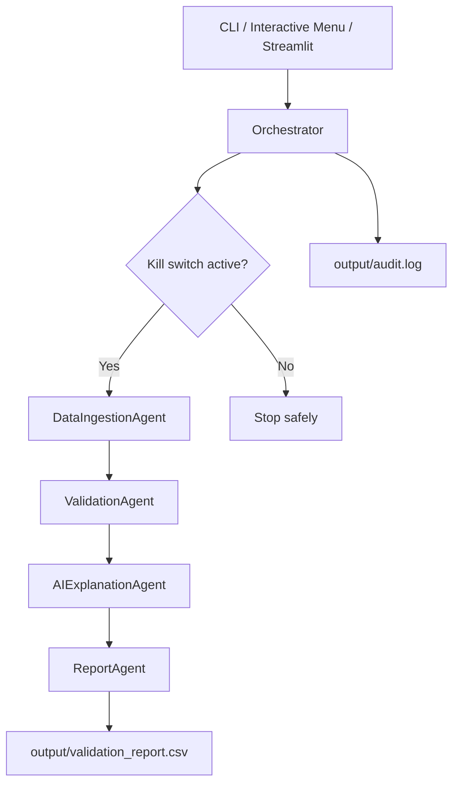
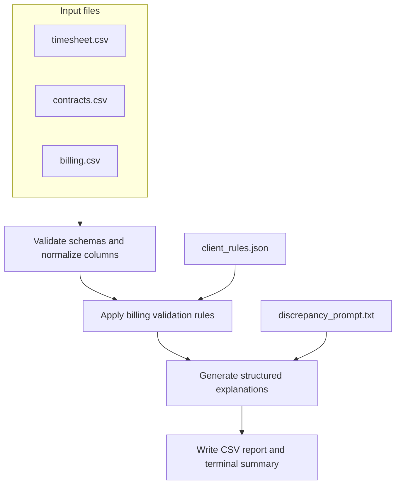

# Architecture: Billing Validation Agent System

## Overview

The system uses a **Hybrid Orchestration** pattern: a central Orchestrator delegates work to
specialized Worker Agents. Workers are isolated, which keeps each step focused and makes the
workflow easier to audit and control.

Use the root [`README.md`](../README.md) for setup and basic usage. This document explains how
the workflow runs, how data moves through it, what the report contains, and why the repository
is structured the way it is.

## Architectural Strategy

The architecture separates coordination, business validation, AI explanation, reporting, and
governance into distinct responsibilities. The orchestrator controls execution order and safety
checks, while each worker agent owns one focused step. This keeps the workflow easy to inspect,
test, and extend without mixing validation rules, provider calls, interface code, and operating
controls in the same place.

Configuration files hold client-specific policy, prompt files define the AI instruction contract,
and governance files make operational controls visible. This structure supports repeatable local
runs today and leaves clear extension points for additional clients, interfaces, provider options,
and future agent-to-agent workflow steps.

## Requirements-to-Agent Mapping

This mapping connects the user stories in [`requirements.md`](requirements.md) to the agents and
interfaces that satisfy them. It keeps ownership clear, so each agent has a focused responsibility
and the workflow can run with minimal handoffs.

| Requirements Covered | Owner | Evidence |
|---|---|---|
| `US-001` Source data intake | `DataIngestionAgent` | The ingestion agent reads the source files, normalizes their column names, and stops early if a required column is missing. |
| `US-002` Billing amount reconciliation; `US-003` billing exception detection | `ValidationAgent` | The validation agent calculates the expected and billed amounts, compares them, and assigns the appropriate exception flags. |
| `US-004` Reviewable validation report | `ReportAgent` | The report agent writes the final CSV so a reviewer can inspect the row status, exception flags, calculated amounts, and the `AI_Explanation` field that stores the JSON explanation for each error row. |
| `US-005` Orchestrated pipeline execution | `Orchestrator` | The orchestrator runs the agents in order and checks governance controls before each step, which keeps the pipeline repeatable and auditable. |
| `US-006` Structured discrepancy explanations | `AIExplanationAgent` | The explanation agent turns each error row into a JSON object and writes it into the `AI_Explanation` field of the final validation report. That object includes the finding, recommended remediation, financial deviation, business interpretation, and human-review metadata. |
| `US-007` User review interfaces | CLI / Interactive Menu / Streamlit | The CLI runs the validation from a command, the interactive menu guides a local user through common actions, and the Streamlit interface lets a reviewer upload files and inspect results in a browser. |

## System Workflow (Pipeline)

The orchestrator is the only component that coordinates the full workflow. Each worker agent
returns results to the orchestrator rather than calling other agents directly.



| Step | Agent | Responsibility |
|---|---|---|
| 1 | `DataIngestionAgent` | Reads billing, timesheet, and contract files; validates required columns |
| 2 | `ValidationAgent` | Merges datasets, applies client rules, computes flags and amounts |
| 3 | `AIExplanationAgent` | Adds AI explanations to `ERROR` rows |
| 4 | `ReportAgent` | Writes CSV output and prints a terminal summary |

## Data Flow

Input data is read from files, normalized into DataFrames, validated against client rules,
enriched with explanations, and written as a final CSV report.



## Output Report Shape (CSV)

The workflow produces a single reviewable dataset: `output/validation_report.csv`. Each row
corresponds to an employee and project record, and the report includes both the validation
result and the supporting context needed for review.

Key fields:

| Field | Meaning |
|---|---|
| `Status` | `OK` when no exceptions are found; `ERROR` when one or more exception flags are present |
| `Flags` | A comma-separated list of exception codes for the row |
| `Expected_Amount` | What the row should cost based on the timesheet and contract |
| `Billed_Amount` | What the invoice proposes billing for the row |
| `Difference` | `Billed_Amount - Expected_Amount` |
| `AI_Explanation` | A JSON string containing the structured explanation for each error row |

The detailed formulas for flags and calculated fields are documented in
[`validation-logic.md`](validation-logic.md).

## Explanation Contract (`AI_Explanation` JSON)

The final report includes an `AI_Explanation` field for each error row. `AIExplanationAgent`
writes a JSON string into that field so the same explanation structure can be reused for review,
escalation, credit workflows, or audit reporting.

```json
{
  "schema_version": "1.0",
  "record": {
    "employee_id": 102,
    "employee_name": "Bob",
    "project": "A"
  },
  "status": "ERROR",
  "flags": ["RATE_MISMATCH", "OVERBILLING"],
  "explanation": "Plain-English explanation of what went wrong.",
  "corrective_action": "Recommended action for the billing team.",
  "financial_deviation": {
    "expected_amount": 760.0,
    "billed_amount": 880.0,
    "difference": 120.0,
    "direction": "overbilled",
    "business_meaning": "The invoice may charge the client more than the contract and timesheet support, creating credit exposure and client trust risk."
  },
  "human_review": {
    "required": true,
    "reviewer_role": "billing_supervisor",
    "reason": "AI-generated remediation recommendations are advisory and must be approved before credits or invoice adjustments."
  },
  "metadata": {
    "generation_mode": "configured_provider",
    "source": "AIExplanationAgent"
  }
}
```

### Why Structured JSON Instead of Free-Form Text

AI-generated language is valuable for explaining business context, but free-form prose is not a
reliable interface for automated workflows. The architecture therefore requires each explanation
to follow a structured JSON contract with known fields such as `flags`, `financial_deviation`,
`corrective_action`, and `human_review`.

This design treats determinism as the default operating boundary for business processes. The AI
provider can still produce natural-language reasoning inside controlled fields, but the artifact
it returns has a predictable shape that can be parsed, validated, logged, reviewed, and reused by
other agents. This is the practical frontier for enterprise AI automation: use deterministic
contracts where the business needs reliability, and allow probabilistic reasoning only inside
bounded parts of the workflow where it adds judgment, explanation, or context.

The JSON contract works as an agent-to-agent interface. It gives each workflow step a predictable
machine-readable structure, so future agents and business processes can consume the validation
result, understand the same fields, and continue the workflow without reinterpreting free-form
text.

The structured contract creates several advantages:

- **Reliable parsing:** downstream tools can read the same fields every time instead of trying to
  infer meaning from unstructured paragraphs.
- **Testable output:** automated tests can verify that required fields are present and that
  financial values follow the expected formulas.
- **Auditability:** reviewers can see which flags, amounts, recommendations, and governance
  metadata were produced for each error row.
- **Agent reuse:** the explanation artifact can become input for escalation, credit review,
  reporting, or future autonomous workflow steps.
- **Human-in-the-loop control:** the `human_review` object keeps corrective action recommendations
  advisory until a billing supervisor approves them.
- **Gradual autonomy:** the workflow can expand AI usage over time while preserving clear decision
  boundaries, operational controls, and business accountability.

## AI Execution Behavior

### AI-First Behavior

When an API key is configured, the explanation agent generates the JSON explanation using the
selected AI provider. The provider is selected with `AI_PROVIDER`, and the current implementation
supports Anthropic, OpenAI, and OpenAI-compatible endpoints through `OPENAI_BASE_URL`. The output
format stays the same across providers because the report always stores explanations using the
same JSON contract.

### Deterministic Fallback

The system also supports a deterministic explanation path that produces the same JSON contract
shape. This keeps report generation reliable, preserves auditability, and gives operators
explicit control through the `--no-ai` flag when they need predictable, non-networked behavior.

## Governance and Human Review

The system treats AI-generated remediation as advisory. The explanation contract includes a
`human_review` object so supervisor approval remains explicit before credits, invoice
adjustments, or client-facing corrections are issued.

Operational controls are enforced around the agent workflow. The orchestrator checks the kill
switch before each step, writes audit events to `output/audit.log`, and keeps generated reports
under `output/` so review artifacts are easy to find.

## Repository Structure

The repository layout mirrors the system responsibilities. Entry points start the workflow,
worker agents perform focused business tasks, the orchestrator controls execution, and separate
configuration and governance files keep operating rules visible instead of hiding them inside
validation code.

The table below shows where each responsibility lives and when a maintainer should open that
part of the project.

| Responsibility | Files or Folder | Purpose | When to Look Here |
|---|---|---|---|
| User entry points | `main.py`, `app.py` | These files expose the validation workflow through the command line and the browser interface. | Open these files when changing how a user starts a run, uploads files, or reviews results. |
| Worker agents | `agents/` | Each agent owns one step of the workflow: ingestion, validation, explanation, or reporting. | Open this folder when changing the behavior of a specific pipeline step. |
| Workflow coordination | `orchestrator/` | The orchestrator runs the agents in order, checks the kill switch, writes audit events, and handles execution errors. | Open this folder when changing workflow order or governance around agent execution. |
| Client rules | `config/client_rules.json` | Client-specific validation policy is stored as configuration so tolerances and limits can change without editing source code. | Open this file when adding a client or adjusting validation thresholds. |
| Governance controls | `governance/` | Operational controls are documented as project artifacts so permissions and stop conditions are easy to review. | Open this folder when reviewing role access, agent permissions, or kill-switch behavior. |
| AI prompt contract | `prompts/` | AI instructions are version-controlled outside source code so the explanation behavior can be reviewed and changed deliberately. | Open this folder when updating the explanation prompt or JSON contract instructions. |
| Regression tests | `tests/` | Tests protect validation formulas and contract behavior when the implementation changes. | Open this folder when verifying behavior after code, rule, or prompt changes. |

## Multi-Client Support

Validation rules are loaded from `config/client_rules.json` at runtime.
Pass `--client <name>` to select a rule set. No code changes are required to add a new client.

```json
{
  "teleperformance": {
    "allow_rate_tolerance": 0,
    "max_hours_enforcement": true,
    "overbilling_threshold": 0
  },
  "client_b": {
    "allow_rate_tolerance": 2,
    "max_hours_enforcement": false,
    "overbilling_threshold": 1
  }
}
```

## Interface Options

| Mode | Command |
|---|---|
| Orchestrated pipeline | `python main.py --mode orchestrated --input data/input/billing.csv --verbose` |
| Interactive menu | `python main.py --interactive` |
| No AI (deterministic) | `python main.py --no-ai --input data/input/billing.csv` |
| Web UI | `streamlit run app.py` |

## Related Details

- Validation calculations and flags: [`validation-logic.md`](validation-logic.md)
- Governance and Human-in-the-Loop controls: [`governance.md`](governance.md)
- Functional requirements: [`requirements.md`](requirements.md)
- Decision records: [`decisions/`](decisions/)
