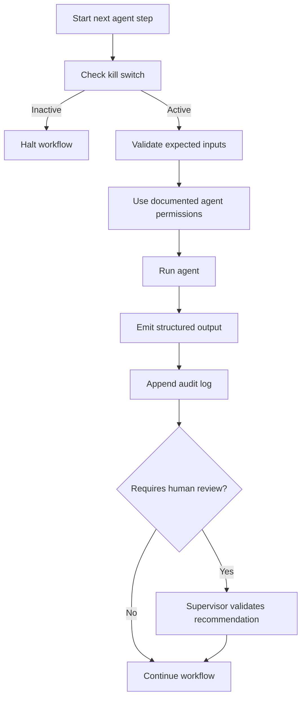

# Governance — Billing Validation Agent System

## Purpose

The system is designed for controlled automated review. AI can explain discrepancies and
recommend remediation, but it does not approve credits, invoice adjustments, or client-facing
corrections on its own.

## Human-in-the-Loop

AI-generated remediation recommendations are advisory. A billing supervisor must validate the suggested
action before any operational change is issued.

This control keeps decisions:

- Inside the agent's scope of competence.
- Reviewable by a human owner.
- Justifiable during external audit.
- Separate from automated discrepancy detection.

## Operational Controls

| Control | Implementation |
|---|---|
| Kill switch | `governance/kill_switch.json` is checked by the orchestrator before each step |
| Audit log | `output/audit.log` records timestamp, agent, event, and detail |
| Role model | `governance/rbac.json` documents analyst, admin, and viewer permissions |
| Agent permissions | `governance/rbac.json` documents which resources each agent can access |
| Secret management | `.env` stores `AI_PROVIDER` and the selected provider key; `.env.example` documents Anthropic, OpenAI, and compatible endpoint variables |
| Output boundary | Generated reports and logs are written under `output/` |

## Autonomous Workflow Governance Technique

The workflow uses a step-by-step governance technique: each autonomous step is bounded by
explicit inputs, permissions, outputs, and review controls.

| Step | Governance Technique | Purpose |
|---|---|---|
| 1 | Define the agent's task boundary | Keep each agent focused on one responsibility |
| 2 | Validate inputs before execution | Prevent downstream decisions from using malformed data |
| 3 | Check the kill switch before each step | Give operators a simple way to halt the pipeline safely |
| 4 | Execute with least-privilege access | Limit each agent to the files and actions it needs |
| 5 | Emit structured outputs | Make results reusable, testable, and auditable |
| 6 | Log every step | Preserve an evidence trail for troubleshooting and review |
| 7 | Route recommendations to human review | Keep financial corrections under supervisor authority |
| 8 | Fail closed with deterministic fallback | Preserve useful output without giving the AI uncontrolled authority |

Applied to this project, the orchestrator performs the governance loop around every agent:

## Agent Permission Model

| Agent | Intended Access |
|---|---|
| `DataIngestionAgent` | Read input data files |
| `ValidationAgent` | Read validation rules |
| `AIExplanationAgent` | Read prompt template and call the configured AI provider when a matching key is available |
| `ReportAgent` | Write report output and audit-related artifacts |

## Failure Behavior

- If the kill switch is inactive, the orchestrator halts before starting the next agent step.
- If the configured AI provider is unavailable, the explanation agent falls back to deterministic rule-based text.
- If an agent raises an error, the orchestrator logs the failure and re-raises the exception.
